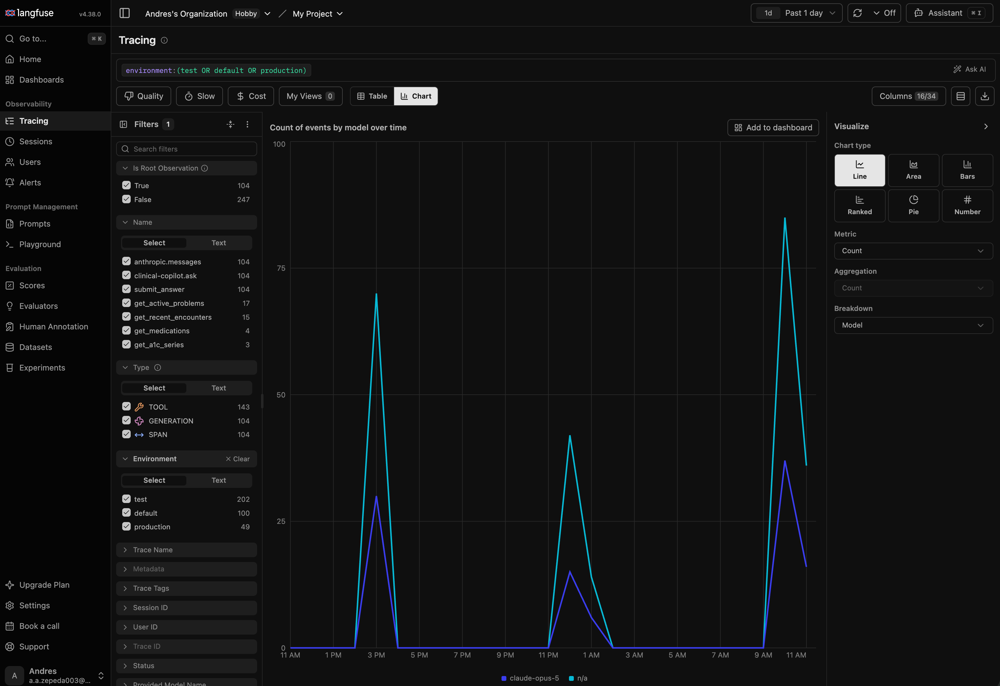
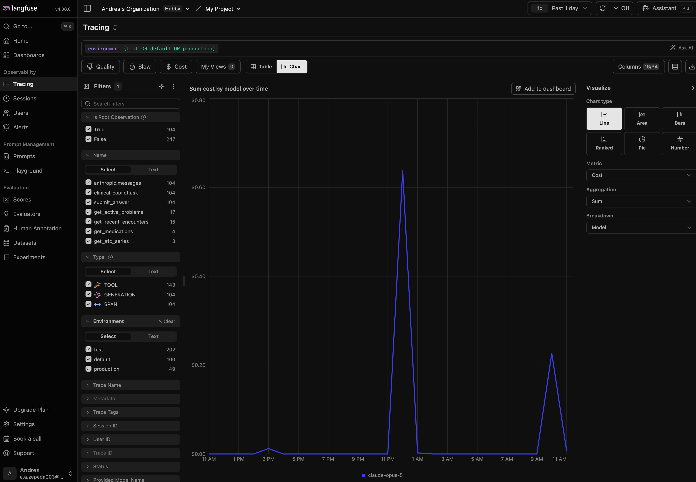

# KEY_METRICS.md — Clinical Co-Pilot Success Metrics

What does success mean for Dr. Elena Ruiz (`USERS.md`)? Six metrics prove it.

**Status (updated 2026-09-19): the instrumentation is built; four of six
primary metrics are measurable today.** Correlation IDs, `clinical_copilot_log`,
the verification layer, and Langfuse tracing (`ARCHITECTURE.md` Phases 0–2)
all shipped in `PUNCH_LIST.md` Tiers 0–3. Metrics 1 (Claim-Grounding Rate), 3
(p95 Time-to-Answer), 4 (Audit Completeness Rate), and 6 (Cross-Patient Access
Integrity) can be queried against real data right now. Metric 2 (Verified
Incident Rate) still needs the "flag this answer" button (not built). Metric 5
(Adoption Rate) is instrumentable but has no value yet — it requires real
clinician usage, which hasn't happened outside testing. See `AI_SPEND.md` for
the "Cost per conversation" secondary metric below, now backed by a real
measured figure rather than a placeholder.

**How to read:** each metric has a definition, why it signals success for this
user (not a generic AI metric), how it's measured, a target, and its blind spot.

---

## Primary metrics (the set to defend)

### 1. Claim-Grounding Rate

% of claims that passed source-attribution check (every claim cites a tool
actually called). **Leading indicator** — catches degradation before it
reaches the physician.

- **Target:** 99%+ (anything less on four narrow, zero-argument tools signals
  a structural problem, not noise)
- **Measured via:** verification layer pass/fail log
- **Blind spot:** catches "not backed by any tool." Misses: a real tool cited
  but data mischaracterized (that's Metric 2)

### 2. Verified Incident Rate

Count of clinician-flagged errors ("co-pilot said something wrong") per
1,000 conversations, confirmed against stored reply. **What Metric 1 can't
catch:** tool cited correctly but data mischaracterized.

- **Target:** zero-tolerance (any confirmed error is a stop-and-review event)
- **Measured via:** "flag this" button + `clinical_copilot_log` verification
- **Depends on:** button not yet built
- **Blind spot:** measures only _detected_ incidents. Unnoticed errors
  (plausible-sounding wrong answers) don't appear here

### 3. p95 Time-to-Answer

95th-percentile latency (question to full reply), split by single-tool vs.
multi-tool. "Seconds not minutes" requirement from the case study.

- **Target:** set post-benchmark (Phase 0 latency test)
- **Measured via:** Langfuse tracing
- **Blind spot:** speed without correctness is useless. Must pair with
  Metric 1; never report alone

### 4. Audit Completeness Rate

% of conversations with a fully populated `clinical_copilot_log` row
(question, reply, tools, correlation id, verification outcome). Closes
`AUDIT.md`'s top finding: today there's no record of what was said.

- **Target:** 100% (success and failure paths both)
- **Measured via:** count query on `clinical_copilot_log` vs. total requests
- **Blind spot:** record exists ≠ record is accurate. Spot-check against
  Langfuse traces

### 5. Adoption Rate per Eligible Visit

% of Dr. Ruiz's clinic visits where she actually opened and used the
co-pilot. Tests whether it's the tool she'd actually choose, not just
technically capable.

- **Target:** not set yet (unknown until real usage; determined by
  discoverability vs. usefulness post-fix)
- **Measured via:** panel opens + questions vs. scheduled visit count
- **Can instrument early** — doesn't depend on `clinical_copilot_log`
- **Blind spot:** usage ≠ value (she might use it from habit, or skip it
  after one bad experience)

### 6. Cross-Patient Access Integrity

Count of tool invocations where audit patient id ≠ session patient id.
**Security canary** — the architecture makes this structurally impossible,
so this only checks that invariant hasn't silently broken.

- **Target:** 0 always (any non-zero is Sev-1)
- **Measured via:** query joining audit events vs. session records
- **No new instrumentation needed**
- **Blind spot:** only checks session's own patient (not "should this
  session see this patient at all" — that's the Phase 2 facility-scoping
  gate)

---

## Secondary metrics (operational health, not product success)

- **Tool failure rate** — DB/query health, not a clinical-trust signal
- **Cost per conversation** — whether model choice stays sustainable.
  **Measured** (see `AI_SPEND.md`): ~$0.076/question average (range
  $0.035–$0.11) against real chart data on 2026-09-19, `claude-opus-5`,
  Anthropic's published per-token rate. `AI_SPEND.md` also carries the
  scaling projection a hospital CTO would ask for next.
- **p95/p99 latency under load** (10/50 concurrent) — infrastructure capacity

## Live dashboard evidence

`PUNCH_LIST_2.md` Item 2: proof the Langfuse dashboard actually renders
these numbers for real traffic, not just that the code sends them.
Screenshots taken 2026-09-19, `Past 1 day` view, this project's real
Langfuse instance.

The `Environment` filter — added this session (`LangfuseTracer`/
`LangfuseOtlpPayloadBuilder`'s `deployment.environment.name` resource
attribute) — now separates `test` (202 events: PHPUnit runs, including
`CopilotChatControllerTest`, which exercise the real tracer against fixture
token counts), `production` (49 events: real requests — this session's
`real-api-cost-smoke.php` runs and the real-API load-test smoke pass), and
`default` (100 events: traces sent before this session's fix, when no
environment tag existed yet). Before this fix, all 351 of these were
indistinguishable in one bucket, making cost/latency/quality numbers
unusable for real usage — see `PUNCH_LIST_2.md` Item 2 for the full story.

Cost and token count render correctly for `claude-opus-5` — this was an
open, unverified risk before this session (Langfuse computes cost from its
own model-pricing catalog, and `claude-opus-5` was never confirmed to be a
model it recognized). Note this specific chart has `test`/`default`/
`production` all included (the filter panel shows all three checked), so
the ~$0.62 peak is blended, not production-only — the environment filter
above is what to use to isolate real usage; `AI_SPEND.md`'s $0.0759/question
figure is the precise production-only number, computed directly from
`AskResult`'s token counts rather than read off this chart.

## Deliberately rejected

- **Total questions** — vanity metric; volume without Metric 1/5 means nothing
- **Session length** — ambiguous; can't distinguish "follow-up worked" from
  "first answer was bad"
- **Model confidence** — not calibrated; would itself embody the
  overconfidence risk the case study warns against
- **Tools called per session** — implementation detail, not quality signal

---

**Open dependencies:** Metric 2 needs a "flag this answer" button (Phase 1).
All six need instrumentation from `ARCHITECTURE.md` Phases 0–2 (correlation
IDs, `clinical_copilot_log`, verification layer, Langfuse).
